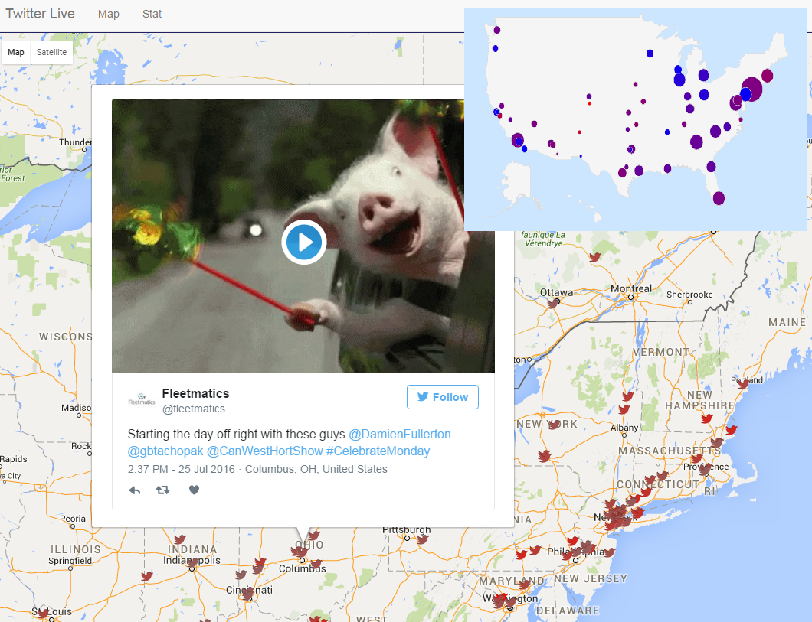

#Twitter Big Data

##Description
Twitter Big Data is a project created during 2016 Krakow Bootcamp training hackathon. It's main goal was to investigate a possibility of using public stream of tweets that are provided near real time by Twitter API to do geospatial analysis.



##Contributors
Grzegorz Skiba <Grzegorz.Skiba@autodesk.com> <br>
Maciej Sapun <Maciej.Sapun@autodesk.com> <br>
Michał Gwiżdż <Michal.Gwizdz@autodesk.com> <br>
Robert Woźniak <Robert.Wozniak@autodesk.com> <br>
Tomasz Domański <Tomasz.Domanski@autodesk.com> <br>

##Setup instructions

####Prerequisites
> - Nodejs and npm (https://nodejs.org/en/download)
> - Twitter application credentials (https://apps.twitter.com/)

####Run locally
- Add following entry to your hosts file
```
127.0.0.1 twig-bro.com
```
- Clone this repo
- Rename file [server/auth/_twitterKeys.js](server/auth/_twitterKeys.js) to server/auth/twitterKeys.js and provide your Twitter app credentials
```
// rename this file to twitterKeys.js and provide your credentials
module.exports = {
  consumer_key: 'YOUR_TWITTER_CONSUMER_KEY_HERE',
  consumer_secret: 'YOUR_TWITTER_CONSUMER_SECRET_HERE',
  token: 'YOUR_TWITTER_TOKEN_HERE',
  access_token_key: 'YOUR_TWITTER_TOKEN_HERE',
  token_secret: 'YOUR_TWITTER_TOKEN_SECRET_HERE',
  access_token_secret: 'YOUR_TWITTER_TOKEN_SECRET_HERE'
};
```
- Run following commands in shell in project main directory
```
$ npm install
$ bower install
$ npm start 
```
- Open web browser and navigate to http://twig-bro.com
